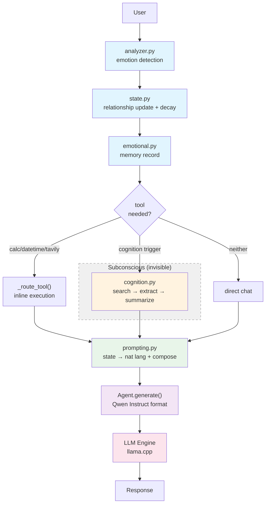

# Veil Core

Veil is a **personality-centric local AI companion runtime** built on llama.cpp and GGUF models.

It is designed as a persistent character system with emotional continuity, not just an agent framework with a prompt wrapper.

```
personality system with capabilities
beyond an agent with personality
```

---

# Features

## Emotional Core

- **Emotion analysis** — keyword-based valence/arousal detection from user input
- **Relationship state** — 5-dimensional dynamic model (affection, trust, attachment, comfort, dependency)
- **Stage progression** — "kenalan" → "akrab" → "dekat" → "sayang" → "istimewa" (non-linear, derived from state)
- **Mood modulation** — warm, playful, guarded, yearning, neutral — shifts naturally per interaction
- **State decay** — prevents relationship from being permanently maxed out
- **Emotional mode** — comforting/withdrawn/yearning/excited/soft with mode_strength; resists overwrite when > 0.5
- **Emotional memory** — stores interactions with valence/arousal weight; salience filter prevents pollution

## Personality System

- **Stella** — Indonesian-first companion with natural conversational style
- **No mode switching** — dynamic state modulation replaces rigid mode toggles
- **Identity permanence** — humor, warmth, teasing, emotional openness, protectiveness as fixed traits
- **No numeric values in prompts** — state mapped to natural language descriptors
- **Trust default 0.35** — prevents premature guarded mood after first decay

## Memory System

- **Short-term memory** — recent conversation with 4k budget, chat-template format, ignore/truncate rules
- **Long-term memory** — persistent JSON, per-tier quota (5 importance + 5 recency), dedup, structured extraction
- **Emotional memory** — valence/arousal records with recurrence merging and salience filtering

## Tool System

Tools are executed **invisibly** behind the personality layer. Users see natural responses, not execution traces.

| Tool | Description |
|------|-------------|
| `web_search` | Tavily `/search` — web search with TTL cache; `rfind`-based prefix stripping |
| `web_extract` | Tavily `/extract` — URL content extraction |
| `calculator` | Safe eval — math + percentage + functions (sqrt, sin, cos), injection blocked |
| `datetime` | WIB Indonesian locale |

Tool routing runs **before** cognition — calculator/datetime/tavily always take priority over web search.

## Cognition (Subconscious)

- `core/cognition.py` — invisible search→extract→summarize pipeline
- No DAG, no JSON planning, no visible execution
- Triggered automatically when factuality is needed
- Results injected as natural context, not raw execution output
- Search query auto-cleaned: `"halo, cari kurs dollar"` → `"kurs dollar"`

## TUI (Optional)

A rich-based split-panel TUI is available via `app_tui.py`:
- Emotional state header (mood, trust, attachment, stage)
- Scrollable color-coded conversation history (green=user, cyan=Stella)
- Clean input prompt

```bash
pip install rich   # if not already installed
python app_tui.py
```

---

# Architecture



---

# Project Structure

```text
Veil/
├── app.py                      ← CLI entry point
├── app_tui.py                  ← TUI entry point (rich, split-panel)
├── config.py                   ← all tunables + .env
├── test_agent.py               ← 43 assertions
│
├── core/
│   ├── cognition.py            ← invisible search→extract→summarize
│   ├── orchestrator.py         ← pure infra boundary (run_tool)
│   └── agent.py                ← LLM wrapper + history
│
├── llm/
│   └── engine.py               ← llama.cpp wrapper + sanitize
│
├── memory/
│   ├── emotional.py            ← valence/arousal records, salience filter
│   ├── extractor.py            ← structured fact extraction
│   ├── short_term.py           ← 4k budget, chat-template format
│   ├── long_term.py            ← JSON, importance (explicit)
│   └── store.py                ← atomic persistence
│
├── personality/
│   ├── core.py                 ← thin coordinator (analyze → decide → respond)
│   ├── state.py                ← StellaIdentity + StellaState (5-dim, decay)
│   ├── analyzer.py             ← keyword → EmotionAnalysis
│   ├── prompting.py            ← state → natural language descriptor
│   ├── stella.py               ← identity constants (base, rules, safety)
│   ├── persistence.py          ← save/load state.json (schema v2)
│   ├── inactivity.py           ← absence detection + relationship deltas
│   ├── initiative.py           ← probabilistic openers on user return
│   └── rhythm.py               ← 7-priority matrix + mode modulation + reactions
│
├── tools/
│   ├── base.py                 ← BaseTool + ToolResult + ToolContext + ToolRegistry
│   ├── web/
│   │   └── search.py           ← Tavily REST + _CachedMixin
│   └── system/
│       ├── calculator.py       ← safe eval
│       └── datetime.py         ← WIB locale
│
├── utils/
│   ├── logger.py               ← structured logging
│   └── async_utils.py          ← with_retry (used by search)
│
├── requirements.txt
├── .env.example
├── README.md
└── AGENT.md
```

---

# Installation

```bash
git clone https://github.com/suryardh/Veil-Core-Project.git
cd Veil-Core-Project

python -m venv .venv
```

## Activate Virtual Environment

### Windows
```bash
.venv\Scripts\activate
```

### Linux / macOS
```bash
source .venv/bin/activate
```

## Install Dependencies
```bash
pip install -r requirements.txt
```

---

# Model Setup

Recommended: **Qwen2.5-3B-Instruct Q4_K_M GGUF**

Place inside `models/`:
```
models/qwen2.5-3b-instruct-q4_k_m.gguf
```

Inference backend: llama.cpp via `llama-cpp-python`

---

# Configuration

Main config in `config.py`:
- CPU thread allocation
- Sampling parameters (temp, top_p, repeat_penalty)
- Context size (4096)
- Context budgeting (system: 2.5k, history: 2.5k, response: 800)
- Max tokens: 300 (normal), 400 (stream)
- Memory limits
- Search timeout & cache size

Environment overrides:
```bash
VEIL_TEMP=0.9
TAVILY_API_KEY=tvly-...
```

---

# Run

### CLI (default)
```bash
python app.py
```

### TUI (rich-based)
```bash
python app_tui.py
```

---

# Testing

```bash
python test_agent.py
```

### TUI (rich-based)
```bash
python app_tui.py
```

43 tests (passing):
- calculator (6)
- datetime (4)
- long-term memory (6)
- short-term memory (4)
- emotional analysis (9)
- state management (6)
- emotional memory (4)
- orchestrator (1)
- LLM integration (3)

---

# License

MIT License
