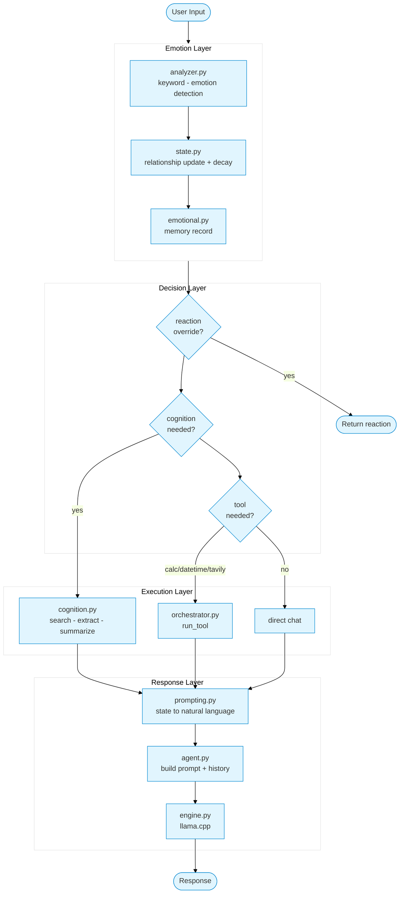

# Veil Core

Veil is a **personality-centric local AI companion runtime** built on llama.cpp and GGUF models.

It is designed as a persistent character system with emotional continuity, not just an agent framework with a prompt wrapper.

```
personality system with capabilities
beyond an agent with personality
```

---

# Features

## Emotional Core

- **Emotion analysis** — keyword-based valence/arousal detection from user input
- **Relationship state** — 5-dimensional dynamic model (affection, trust, attachment, comfort, dependency)
- **Mood modulation** — warm, playful, guarded, yearning, neutral — shifts naturally per interaction
- **State decay** — prevents relationship from being permanently maxed out
- **Emotional mode** — comforting/withdrawn/yearning/excited/soft with mode_strength; resists overwrite when > 0.5
- **Emotional memory** — stores interactions with valence/arousal weight; salience filter prevents pollution

## Personality System

- **Stella** — Indonesian-first companion with natural conversational style
- **No mode switching** — dynamic state modulation replaces rigid mode toggles
- **Identity permanence** — humor, warmth, teasing, emotional openness, protectiveness as fixed traits
- **No numeric values in prompts** — state mapped to natural language descriptors
- **Conflict dynamics** — directed insults trigger cooling, withdrawn mode, gradual recovery, reconciliation halving; third-party venting and neutral chat are ignored
- **Persona rules v3.1** — centralized rules (`personality/rules.py`) with pseudo-memory and relationship-inference guards (Stella never invents experiences her memory doesn't support or assumes feelings about the user without evidence)
- **Trust default 0.35** — prevents premature guarded mood after first decay

## Memory System

- **Short-term memory** — recent conversation with 8-message / chat-template budget, ignore/truncate rules
- **Long-term memory** — persistent JSON (up to 500 facts), relevance-scored injection (top 10), dedup, keyword-importance extraction
- **Fact extraction** — `memory/extractor.py` turns seeds ("aku ulang tahun bulan depan") into importance-weighted facts
- **Emotional memory** — valence/arousal records with recurrence merging and salience filtering

## Tool System

Tools are executed **invisibly** behind the personality layer. Users see natural responses, not execution traces.

| Tool | Description |
|------|-------------|
| `web_search` | Tavily `/search` — web search with TTL cache; `rfind`-based prefix stripping |
| `web_extract` | Tavily `/extract` — URL content extraction |
| `calculator` | Safe eval — math + percentage + functions (sqrt, sin, cos), injection blocked |
| `datetime` | WIB Indonesian locale |

Tool routing runs **after** cognition — cognition tried first, then tool routing for calculator/datetime/tavily. This prevents "hari ini" (datetime trigger) from stealing search queries.

## Cognition (Subconscious)

- `core/cognition.py` — invisible search→extract→summarize pipeline
- No DAG, no JSON planning, no visible execution
- Triggered automatically when factuality is needed
- Results injected as natural context, not raw execution output
- Search query auto-cleaned: `"halo, cari kurs dollar"` → `"kurs dollar"`
- Uses Tavily `include_answer` + `search_depth=advanced` for richer results (AI answer + 3 snippets)
- Results injected as natural continuation in user message (no `=== Search Results ===` delimiter)

## Behavioral Evaluator (deterministic)

`core/evaluator.py` — pure, no-LLM metrics for regression and nightly eval:

- **Phrase echo** — user's distinctive words reused instead of clarified (opening mirror, same-stem repeats, hyphen-reduplication)
- **Question persistence** — asking again right after a complaint
- **Closure adherence** — short reply, no new question when the user says goodbye
- **Pet-name frequency** — "sayang" capped per message

`core/constraints.py` — hard reply requirements (no questions, forced closure) with turn-based TTL expiry.

## Evaluation Harness (nightly)

`tools/daily_eval.py` — scheduled 7-day eval (the personality core runs in an isolated sandbox with its own memory/state):

- **Probes** — casual, emotional, memory seed+recall, tool accuracy, boundary-AI, refusal, assistant-trap, conflict, complaint, repair, closure
- **Behavioral metrics** — question persistence, closure adherence, phrase echo
- **LLM-vs-LLM sim session** — optional; drives an "opponent" (OpenAI-compatible endpoint via `.env`) through banter turns to test long-session stability
- **State snapshot** — drift window, relationship dims, mode/stage before/after

`tools/sim_live.py` — manual single-turn banter against any OpenAI-compatible model.

## TUI (Optional)

A rich-based split-panel TUI is available via `app_tui.py`:
- Emotional state header (mood, trust, attachment)
- Scrollable color-coded conversation history (green=user, cyan=Stella)
- Clean input prompt

```bash
pip install rich   # if not already installed
python app_tui.py
```

---

# Architecture


```mermaid
%%{init: {'theme': 'base', 'themeVariables': {'primaryColor': '#e1f5fe', 'primaryBorderColor': '#0288d1', 'tertiaryColor': '#fff'}}}%%
flowchart TB
    Input([User Input])

    subgraph EMOTION["Emotion Layer"]
        direction TB
        Analyzer[analyzer.py<br/>keyword - emotion detection]
        State[state.py<br/>relationship update + decay]
        EmoMem[emotional.py<br/>memory record]
        Analyzer --> State --> EmoMem
    end

    subgraph DECIDE["Decision Layer"]
        direction TB
        React{reaction<br/>override?}
        CogCheck{cognition<br/>needed?}
        ToolCheck{tool<br/>needed?}
        React --> CogCheck --> ToolCheck
    end

    subgraph ROUTE["Execution Layer"]
        direction TB
        Cognition[cognition.py<br/>search - extract - summarize]
        Tool[orchestrator.py<br/>run_tool]
        Direct[direct chat]
    end

    subgraph RENDER["Response Layer"]
        direction TB
        Prompt[prompting.py<br/>state to natural language]
        Agent[agent.py<br/>build prompt + history]
        LLM[engine.py<br/>llama.cpp]
        Prompt --> Agent --> LLM
    end

    Input --> EMOTION
    EMOTION --> React

    React -->|yes| Out([Return reaction])
    CogCheck -->|yes| Cognition
    ToolCheck -->|calc/datetime/tavily| Tool
    ToolCheck -->|no| Direct

    Cognition --> Prompt
    Tool --> Prompt
    Direct --> Prompt

    LLM --> Out2([Response])
```

---

# Project Structure

```text
Veil/
├── app.py                      ← CLI entry point
├── app_tui.py                  ← TUI entry point (rich, split-panel)
├── config.py                   ← all tunables + .env
├── test_agent.py               ← 133 assertions
│
├── core/
│   ├── bootstrap.py            ← App startup consolidation
│   ├── cognition.py            ← invisible search→extract→summarize
│   ├── orchestrator.py         ← pure infra boundary (run_tool)
│   ├── evaluator.py            ← behavioral metrics (phrase echo, closure, questions)
│   ├── constraints.py          ← hard reply requirements with TTL expiry
│   ├── formatter.py            ← tool-result formatting (text/json)
│   └── agent.py                ← LLM wrapper + history
│
├── llm/
│   └── engine.py               ← llama.cpp wrapper + sanitize
│
├── memory/
│   ├── emotional.py            ← valence/arousal records, salience filter
│   ├── extractor.py            ← keyword importance scoring + seed pairs
│   ├── short_term.py           ← 8-msg budget, chat-template format
│   ├── long_term.py            ← JSON, 500-fact cap, relevance injection
│   └── store.py                ← atomic persistence
│
├── personality/
│   ├── core.py                 ← thin coordinator (analyze → decide → respond)
│   ├── state.py                ← StellaIdentity + StellaState (5-dim, decay)
│   ├── analyzer.py             ← keyword → EmotionAnalysis
│   ├── prompting.py            ← state → natural language descriptor
│   ├── stella.py               ← identity constants (base, rules, safety)
│   ├── rules.py                ← centralized personality rules (v3.1)
│   ├── conflict.py             ← insult detection, cooling, recovery, drift
│   ├── persistence.py          ← save/load state.json (schema v3)
│   ├── inactivity.py           ← absence detection + relationship deltas
│   ├── initiative.py           ← probabilistic openers on user return
│   └── rhythm.py               ← priority matrix + mode modulation + reactions
│
├── tools/
│   ├── base.py                 ← BaseTool + ToolResult + ToolContext
│   ├── state_backup.py         ← manual backup/restore data/state.json
│   ├── bench.py                ← fixed-prompt benchmark (baseline comparison)
│   ├── ctx_report.py           ← context budget measurement (tokenizer-based)
│   ├── daily_eval.py           ← scheduled 7-day eval (probes + sim + metrics)
│   ├── sim_live.py             ← manual opponent banter (OpenAI-compatible)
│   ├── web/
│   │   └── search.py           ← Tavily REST + _CachedMixin
│   └── system/
│       ├── calculator.py       ← safe eval
│       └── datetime.py         ← WIB locale
│
├── utils/
│   ├── logger.py               ← structured logging
│   ├── async_utils.py          ← with_retry (used by search)
│   └── text.py                 ← LLM output sanitization (unicode, orphan punct, pet-name damper)
│
├── requirements.txt
├── README.md
└── AGENT.md
```

---

# Installation

```bash
git clone https://github.com/suryardh/Veil-Core-Project.git
cd Veil-Core-Project

python -m venv .venv
```

## Activate Virtual Environment

### Windows
```bash
.venv\Scripts\activate
```

### Linux / macOS
```bash
source .venv/bin/activate
```

## Install Dependencies
```bash
pip install -r requirements.txt
```

### GPU Acceleration (optional, NVIDIA CUDA)

For RTX 4050 / CUDA-equipped GPUs — install the CUDA-enabled llama-cpp-python wheel:
```bash
pip install llama-cpp-python==0.3.25 --extra-index-url https://abetlen.github.io/llama-cpp-python/whl/cu125
```
Pick the `cuXXX` suffix matching your driver's max CUDA runtime (see
`nvidia-smi` header). Then ensure `VEIL_USE_GPU=1` (default in `.env` or environment).

---

# Model Setup

Active model: **Qwen2.5-7B-Instruct-abliterated-v2 Q4_K_M GGUF**
(Rollback baseline: `qwen2.5-3b-instruct-q4_k_m.gguf`, see `BASELINE.md`.)

Place inside `models/`:
```
models/qwen2.5-7b-instruct-abliterated-v2-q4_k_m.gguf
```

Inference backend: llama.cpp via `llama-cpp-python`

## Model Integration Map

Where the model touches the codebase:

```text
config.py                    ← all model knobs
├── MODEL_PATH               models/qwen2.5-7b-instruct-abliterated-v2-q4_k_m.gguf
├── N_CTX=4096  N_THREADS    loaded by llm/engine.py LLMEngine.__init__
├── USE_GPU                  → n_gpu_layers=-1 when enabled (default on)
├── SAMPLING / MAX_TOKENS    merged in engine._default_params()
├── STOP_TOKENS              ["<|im_end|>"]
└── CTX_PROMPT_CHAR_LIMIT    char guard applied in core/agent.py (≈14.5k chars)

Call chain (one generation):
personality/core.py PersonalityCore.handle(user_input)
  → core/agent.py VeilAgent.generate(system, user_input, observation)
      builds raw ChatML (<|im_start|>system/user/assistant<|im_end|>)
      truncates history/prompt via _truncate() + CTX_PROMPT_CHAR_LIMIT
  → llm/engine.py LLMEngine.generate(prompt)
      llama_cpp.Llama(...) call with SAMPLING params (temp 0.6, top_p 0.9)

Persistence around it:
  state: personality/persistence.py ↔ data/state.json (schema v3)
  short-term memory: memory/short_term.py (8 messages, 500 chars/msg)
  long-term memory: memory/long_term.py ↔ memory/long_term.json
```

### Runtime notes

- Sampling tuned 2026-08-26 after live-sim showed word salad at temp 0.7 (MODEL-005).
- ChatML `<|im_start|>/<|im_end|>` matches Qwen2 template — any Qwen2-family GGUF is drop-in; other families need prompt-format changes.
- Context budget is enforced in **characters** (~4.0–4.1 chars/token for Indonesian), measured by `tools/ctx_report.py` — the assembled prompt stays under `CTX_PROMPT_CHAR_LIMIT` so prompt + streaming response fit `N_CTX` with headroom.
- N_CTX=4096 vs the model's larger trained context — headroom chosen for CPU/GPU speed on limited VRAM.

---

# Configuration

Main config in `config.py`:
- CPU thread allocation
- Sampling parameters (temp 0.6, top_p 0.9, min_p 0.05, repeat_penalty 1.15)
- Context size (4096)
- Context guard (`CTX_PROMPT_CHAR_LIMIT` ≈ 14.5k chars, history soft budget 2.5k)
- Max tokens: 300 (normal), 400 (stream)
- Memory limits (8-message short-term, 500-fact long-term)
- Search timeout & cache size
- GPU mode toggle (`USE_GPU`, default yes)

Environment overrides:
```bash
USE_GPU=1              # GPU mode (default) | 0 = CPU-only
VEIL_TEMP=0.6
TAVILY_API_KEY=tvly-...
SIM_API_KEY=...        # OpenAI-compatible key for the eval sim opponent
SIM_BASE_URL=...       # e.g. https://api.groq.com/openai/v1
SIM_MODEL=...          # model name served by that endpoint
```

---

# Run

### CLI (default)
```bash
python app.py
```

### TUI (rich-based)
```bash
python app_tui.py
```

### Nightly evaluation
```bash
python tools/daily_eval.py --now          # run today's day immediately
python tools/daily_eval.py --schedule 21:00   # register a daily Windows task
```

Reports and data land in `logs/eval/`:
- `day_NN_YYYY-MM-DD.md` — human-readable report with probes, metrics, sim transcript, state before/after
- `responses.jsonl` — full per-probe rows (append-only, day-queried)
- `state_history.csv` — relationship dimension traces

---

# Backup & Restore State

`data/state.json` holds accumulated relationship state — back it up before model or runtime changes.

```bash
# create a timestamped backup in data/backups/
python tools/state_backup.py export

# verify a backup against a temporary copy (live state untouched)
python tools/state_backup.py restore data/backups/<file>.json

# actually overwrite the live state file after verification
python tools/state_backup.py restore data/backups/<file>.json --apply
```

Backups are JSON envelopes containing the original payload plus `created_at`,
`schema_version`, and a SHA-256 checksum. Tampered backups and backups from a
newer schema version are rejected on restore. Old backups are never deleted
automatically.

---

# Testing

```bash
python test_agent.py
```

133 tests (passing), split:

- tool system — calculator + datetime (10)
- long-term memory + fact extraction (9)
- short-term memory overflow (4)
- emotional analysis + state + emotional memory (19)
- state backup/restore (10)
- context budget guard (10)
- conflict/cooldown/recovery + sanitizer + evaluator + constraints/TTL (65)
- LLM-dependent e2e — chat, calculator-via-orch, stream (3)

---

# License

MIT License